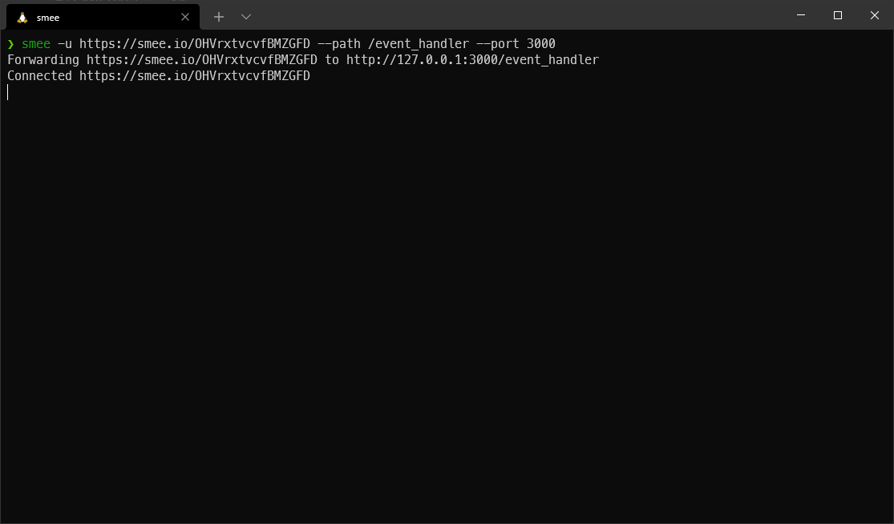
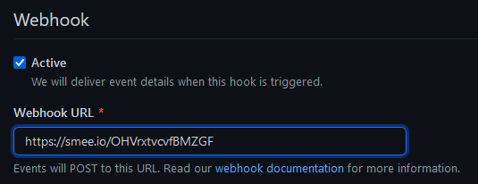

@:t ::t |:t ^:{} \_:{} \*:t TeX:t LaTeX:t

# About

  - This journey was made easier with the help of:
      - [coqbot](https://github.com/coq/bot)
      - [GitHub documentation for creating a first
        bot](https://docs.github.com/en/developers/apps/getting-started-with-apps/setting-up-your-development-environment-to-create-a-github-app)
  - The resulting bot is usubot
  - This article's purpose is to become a tutorial for those who would
    want to use bot-components

# First step

First things first, we need to make sure that we're able to receive
messages from GitHub.

## [smee.io](https://smee.io/)

  - Start by creating a channel on [smee.io](https://smee.io/)
  - Install the smee client:
      - `npm install global smee-client`
      - there are other way that you can find when you create your
        channel
  - Start forwarding any webhooks to your channel to your localhost
      - `smee -u https://smee.io/OHVrxtvcvfBMZGFD --path /event_handler
        --port 3000`
  - Don't stop the client or close the window, this will be helpful for
    the rest of this journey

## Creating a github app

  - Go on your [apps settings page on
    github](https://github.com/settings/apps) and click on create a [New
    Github App](https://github.com/settings/apps/new)

  - Fill the Homepage URL with the url provided by smee:
    
    

  - Fill the Webhook URL with the url provided by smee:
    
    

  - Create a password to secure your webhook endpoints:
    
    
